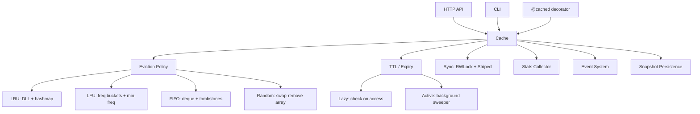

# CacheLite

**A high-performance, zero-dependency in-memory cache engine — built from scratch in Python.**

[](https://github.com/hajirufai/cachelite/actions/workflows/ci.yml)
[](https://www.python.org/)
[](LICENSE)
[](pyproject.toml)

🔗 **Live demo & docs:** https://hajirufai.github.io/cachelite/
📝 **Write-up:** [I Built a Cache Engine from Scratch in Python — and O(1) LFU Eviction Is Sneakier Than LRU](https://dev.to/hajirufai/i-built-a-cache-engine-from-scratch-in-python-and-o1-lfu-eviction-is-sneakier-than-lru-28m7)

CacheLite is the cache behind tools like Redis, Memcached and Guava — implemented
from first principles. Hand-rolled data structures (doubly-linked lists, frequency
buckets, swap-remove arrays) power four eviction policies, plus TTL expiry, thread
safety, snapshot persistence, statistics, pattern invalidation, an HTTP API and a
CLI. No `redis`, no `cachetools`, no `functools.lru_cache` — just the standard
library.

---

## Why this exists

`functools.lru_cache` is great until you need a TTL, a different eviction policy,
size limits, statistics, or to inspect what's cached. At that point most people
reach for Redis. CacheLite sits in between: a real in-process cache with the
ergonomics of a dict and the internals of a production cache server — and it's a
clean reference for *how those internals actually work*.

## Features

- **Four eviction policies**, all O(1):
  - **LRU** — doubly-linked list + hash map
  - **LFU** — frequency buckets with min-frequency tracking
  - **FIFO** — deque with lazy tombstoning
  - **Random** — swap-remove array for O(1) arbitrary deletion
- **TTL expiry**, two strategies (like Redis): lazy (on access) + active (background sweeper with adaptive passes)
- **Thread-safe** — custom reader-writer lock and striped locking
- **Bounded by items *and/or* bytes** — deep size estimation, not just `getsizeof`
- **Snapshot persistence** — JSON or pickle, TTLs survive restarts
- **Statistics** — hits, misses, evictions, hit rate, memory usage
- **Glob pattern invalidation** — `cache.invalidate("user:*")`
- **`@cached` decorator** — memoization with TTL, custom keys, and `None`-safe caching
- **Event hooks** — `on_hit`, `on_miss`, `on_evict`, `on_expire`, …
- **HTTP API** — RESTful server on `http.server`
- **CLI** — `cachelite set/get/keys/stats/serve/demo`
- **Zero dependencies** — Python 3.10+ standard library only

## Install

```bash
git clone https://github.com/hajirufai/cachelite.git
cd cachelite
pip install -e .
```

Or just copy the `cachelite/` package into your project — it has no dependencies.

## Quick start

```python
from cachelite import Cache

cache = Cache(max_items=1000, policy="lru", default_ttl=60)

cache.set("user:1", {"name": "Ada"})
cache.set("user:2", {"name": "Grace"}, ttl=5)   # per-key TTL

cache.get("user:1")          # -> {"name": "Ada"}
cache.ttl("user:2")          # -> ~5.0 seconds remaining
cache.invalidate("user:*")   # bulk delete by glob -> 2

print(cache.stats().as_dict())
```

### Memoize an expensive function

```python
from cachelite import Cache, cached

cache = Cache(max_items=10_000)

@cached(cache, ttl=30)
def fib(n):
    return n if n < 2 else fib(n - 1) + fib(n - 2)

fib(100)            # computed once per n
fib.cache_info()    # CacheStats(...)
fib.cache_clear()   # drop all memoized results
```

### Choose an eviction policy

```python
Cache(max_items=500, policy="lfu")     # least-frequently-used
Cache(max_items=500, policy="fifo")    # first-in-first-out
Cache(max_items=500, policy="random")  # random victim
```

### Persist across restarts

```python
cache.snapshot("cache.json")          # save (JSON or pickle)
fresh = Cache(max_items=1000)
fresh.restore("cache.json")           # reload, TTLs preserved
```

### Background expiry

```python
from cachelite import Cache
from cachelite.core.config import CacheConfig

cache = Cache(config=CacheConfig(
    max_items=10_000,
    active_expiry=True,      # background sweeper thread
    sweep_interval=1.0,
    sweep_sample=20,
))
```

## CLI

```bash
# In-memory demo
python -m cachelite demo

# File-backed key/value store
python -m cachelite --store data.json set user:1 '{"name":"Ada"}'
python -m cachelite --store data.json get user:1
python -m cachelite --store data.json keys 'user:*'
python -m cachelite --store data.json stats

# HTTP API server
python -m cachelite serve --port 8080
```

## HTTP API

```
GET    /health                 health check
GET    /stats                  cache statistics
GET    /keys?pattern=user:*    list keys (optional glob)
GET    /cache/<key>            read a key
PUT    /cache/<key>            store {"value": ..., "ttl": ...}
DELETE /cache/<key>            delete a key
POST   /invalidate             {"pattern": "user:*"} bulk delete
POST   /flush                  clear everything
```

```bash
curl -X PUT  localhost:8080/cache/greeting -d '{"value":"hello","ttl":60}'
curl         localhost:8080/cache/greeting
curl -X POST localhost:8080/invalidate -d '{"pattern":"*"}'
```

## Architecture



How the pieces fit:

- **`Cache`** owns the value store and orchestrates everything under a lock.
- **Eviction policies** only track *ordering metadata* (which key to drop next), never the values — keeping them small and O(1).
- **Expiry** is lazy by default (checked on `get`) with an optional adaptive background sweeper modelled on Redis.
- **Concurrency** uses a reader-writer lock (many readers OR one writer) plus optional striped locking to reduce contention.

## Performance

Single-thread, Python 3.12, commodity hardware (`python benchmarks/bench.py`):

| Operation              | Throughput        |
|------------------------|-------------------|
| `set`                  | ~270K ops/s       |
| `get`                  | ~470K ops/s       |
| LRU insert + evict     | ~270K ops/s       |
| FIFO insert + evict    | ~300K ops/s       |

These are reference numbers for a pure-Python cache — the point is O(1) scaling,
not beating a C extension.

## Testing

```bash
pip install pytest
pytest -q          # 170+ tests
```

The suite covers each eviction policy, TTL semantics, the reader-writer and
striped locks, snapshot round-trips and corruption handling, the decorator, the
event system, the HTTP API, the CLI, and multi-threaded stress tests.

## Project layout

```
cachelite/
├── core/        Cache + config
├── eviction/    LRU, LFU, FIFO, Random + factory
├── expiry/      lazy + active (background) expiry, TTL helpers
├── storage/     in-memory store + snapshot persistence
├── sync/        reader-writer lock + striped locking
├── stats.py     statistics collector
├── patterns.py  glob key matching
├── decorators.py @cached
├── events.py    event hooks
├── api.py       HTTP server
└── cli.py       command-line interface
```

## License

MIT — see [LICENSE](LICENSE).
